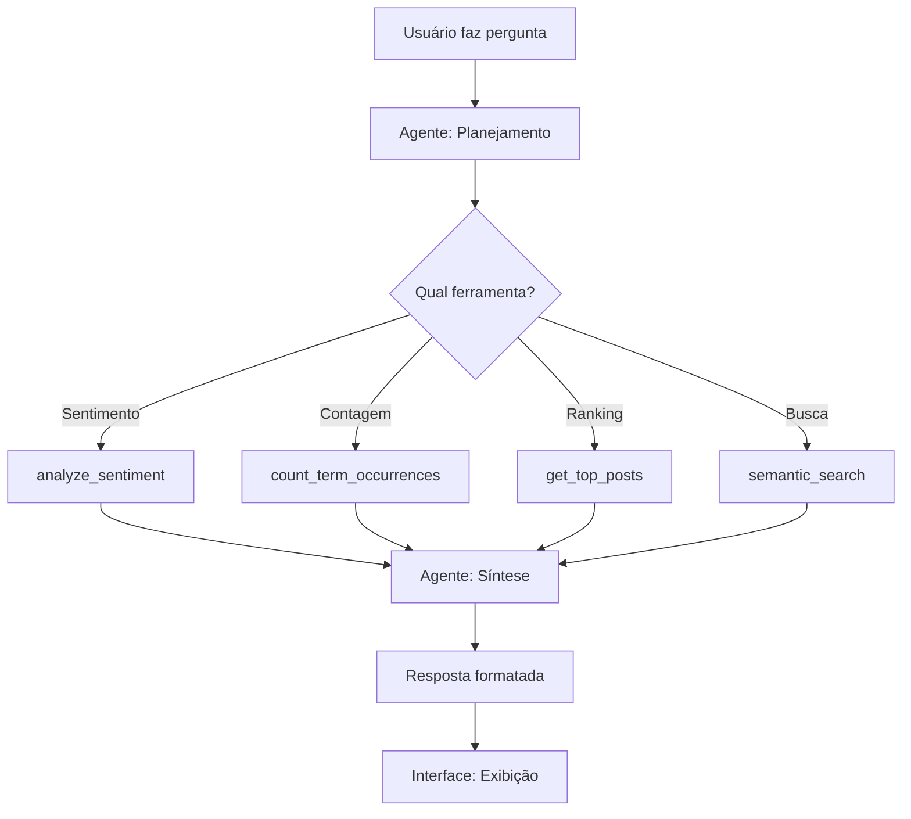

# 📱 UFF Instagram Analytics - Sistema RAG Inteligente

> Sistema de análise semântica e análise de sentimento para posts do Instagram dos perfis institucionais da UFF (Universidade Federal Fluminense) usando IA local.

<div align="center">


**[Início Rápido](#-início-rápido)** • **[Funcionalidades](#-funcionalidades)** • **[Arquitetura](#-arquitetura)** • **[Documentação](#-documentação-completa)**

</div>

---

## 📋 Índice

- [Visão Geral](#-visão-geral)
- [Funcionalidades](#-funcionalidades)
- [Arquitetura do Sistema](#-arquitetura-do-sistema)
- [Início Rápido](#-início-rápido)
- [Configuração](#-configuração)
- [Uso da Interface](#-uso-da-interface)
- [Ferramentas Disponíveis](#-ferramentas-disponíveis)
- [API REST](#-api-rest)
- [Documentação Completa](#-documentação-completa)
- [Solução de Problemas](#-solução-de-problemas)

---

## 🎯 Visão Geral

O **UFF Instagram Analytics** é um sistema completo de análise de posts do Instagram que combina:

- 🤖 **Agente Inteligente** - LLM decide automaticamente quais ferramentas usar
- 🔍 **Busca Semântica** - Encontre posts por significado, não apenas palavras-chave
- 📊 **Análise Quantitativa** - Estatísticas de engajamento, ranking, comparações
- 🎭 **Análise de Sentimento** - Compreenda percepções e opiniões automaticamente
- 💬 **Interface de Chat** - Pergunte em linguagem natural
- 🌐 **100% Local** - Privacidade total, sem enviar dados para APIs externas

### Base de Dados Atual

- **2.413 posts** indexados
- **3 perfis** oficiais da UFF:
  - `@dceuff` (Diretório Central dos Estudantes) - 1.503 posts
  - `@reitor` (Reitoria da UFF) - 575 posts
  - `@vicereitor` (Vice-Reitoria da UFF) - 335 posts

---

## ✨ Funcionalidades

### 🎯 Sistema de Agente Inteligente

O sistema usa um **agente autônomo** que:
1. 📋 **Analisa** sua pergunta em linguagem natural
2. 🧠 **Decide** automaticamente quais ferramentas usar
3. ⚙️ **Executa** as ferramentas necessárias (uma ou múltiplas)
4. 🎨 **Sintetiza** uma resposta clara e completa

**Exemplo:** 
```
Você: "Como o reitor é visto pelos estudantes?"

Agente:
  1. Detecta: pergunta de sentimento
  2. Usa: analyze_sentiment(topic="reitor", profile="dceuff")
  3. Retorna: Análise completa com positivo/negativo, críticas, elogios
```

### 🛠️ 9 Ferramentas Especializadas

| # | Ferramenta | Uso | Exemplo |
|---|-----------|-----|---------|
| 1 | `get_top_posts_by_likes` | Posts mais curtidos | "Post mais curtido do reitor" |
| 2 | `get_top_posts_by_comments` | Posts mais comentados | "Top 5 com mais comentários" |
| 3 | `get_posts_by_engagement` | Maior engajamento total | "Posts com maior interação" |
| 4 | `get_recent_posts` | Publicações recentes | "Posts dos últimos 7 dias" |
| 5 | `get_profile_statistics` | Estatísticas agregadas | "Estatísticas do DCE" |
| 6 | `compare_profiles` | Comparação entre perfis | "Compare os 3 perfis" |
| 7 | `count_term_occurrences` | Contagem de menções | "Quantos posts falam de greve?" |
| 8 | `analyze_sentiment` | Análise de sentimento (IA) | "Como o HUAP é visto?" |
| 9 | `semantic_search` | Busca por conteúdo | "Posts sobre saúde" |

### 🎭 Análise de Sentimento com IA

Ferramenta única que usa LLM para analisar percepção e opiniões:

```
Entrada: "Como o reitor é visto pelos estudantes?"

Saída:
  ✅ 5 posts positivos (25%)
  ❌ 12 posts negativos (60%)
  ⚪ 3 posts neutros (15%)
  
  Aspectos Positivos:
  - Gestão transparente
  - Diálogo com comunidade
  
  Aspectos Negativos:
  - Demora em decisões
  - Falta de comunicação clara
  
  + Resumo narrativo completo
  + Exemplos de posts de cada categoria
```

---

## 🏗️ Arquitetura do Sistema

### Visão Geral

```
┌─────────────────────────────────────────────────────────────┐
│                    INTERFACE GRADIO                          │
│              (Chat + Filtros + Visualizações)                │
└────────────────────────┬────────────────────────────────────┘
                         │
                         ▼
┌─────────────────────────────────────────────────────────────┐
│                    AGENTE RAG (LLM)                          │
│  ┌─────────────┐  ┌──────────────┐  ┌──────────────┐        │
│  │ Planejamento│→ │  Execução    │→ │  Síntese     │        │
│  │  (qwen3:30b)│  │ (Ferramentas)│  │  (qwen3:30b) │        │
│  └─────────────┘  └──────────────┘  └──────────────┘        │
└────────────────────────┬────────────────────────────────────┘
                         │
         ┌───────────────┼───────────────┐
         │               │               │
         ▼               ▼               ▼
┌────────────────┐ ┌──────────┐ ┌──────────────┐
│ ChromaDB       │ │ Análise  │ │ Estatísticas │
│ (Embeddings)   │ │Sentimento│ │  Agregadas   │
│ 2.413 posts    │ │  (LLM)   │ │   (Python)   │
└────────────────┘ └──────────┘ └──────────────┘
         │
         ▼
┌─────────────────────────────────────────────┐
│         DADOS BRUTOS (JSON)                 │
│  dceuff.json | reitor.json | vicereitor.json│
└─────────────────────────────────────────────┘
```

### Componentes Principais

#### 1. **Interface (app.py)**
- Interface web com Gradio 4.0+
- Chat interativo com histórico
- Filtros por perfil
- Exibição de resultados (cards, gráficos, estatísticas)
- Avatar customizado do agente

#### 2. **Agente RAG (agent_system.py)**
- **Planejamento**: LLM analisa a pergunta e decide quais ferramentas usar
- **Execução**: Roda as ferramentas escolhidas (pode ser múltiplas)
- **Síntese**: LLM combina resultados em resposta coerente

#### 3. **Ferramentas (query_tools.py)**
- 9 ferramentas especializadas
- Queries estruturadas no ChromaDB
- Análise de sentimento com LLM
- Estatísticas calculadas em Python

#### 4. **Embeddings (embedding_manager.py)**
- Gerencia ChromaDB
- Modelo: `mxbai-embed-large` (669MB)
- Busca vetorial semântica
- Persistência em disco

#### 5. **Dados (data_loader.py)**
- Carrega posts de arquivos JSON
- Processa e limpa dados
- Extrai metadados (curtidas, comentários, data, etc.)

### Fluxo de Uma Consulta



---

## 🚀 Início Rápido

### Pré-requisitos

- **Python 3.12+**
- **uv** (gerenciador de pacotes)
- **Ollama** (para rodar LLMs localmente)
- **8GB RAM** mínimo (16GB recomendado)
- **20GB** de espaço em disco para modelos

### Instalação em 3 Passos

#### 1. Instalar Ollama

```bash
# Linux
curl -fsSL https://ollama.com/install.sh | sh

# macOS
brew install ollama

# Windows
# Baixe de https://ollama.com/download
```

#### 2. Configurar Projeto

```bash
# Navegue até o diretório
cd /home/marcus/projects/ping

# Sincronize dependências
uv sync
```

#### 3. Instalar Modelos

```bash
# Modelo de embeddings (OBRIGATÓRIO) - 669MB
ollama pull mxbai-embed-large

# Modelo de geração (escolha um):

# Opção 1: Leve - 2GB RAM
ollama pull qwen2.5:3b

# Opção 2: Balanceado - 7GB RAM (recomendado)
ollama pull qwen2.5:7b

# Opção 3: Melhor qualidade - 18GB RAM
ollama pull qwen3:30b  # ← Modelo atual do sistema
```

### Iniciar a Aplicação

```bash
# Modo padrão (porta 7860)
uv run python app.py

# Com modelo específico
uv run python app.py --generation-model qwen2.5:7b

# Criar link público
uv run python app.py --share

# Porta customizada
uv run python app.py --port 8080
```

Acesse: **http://localhost:7860**

---

## ⚙️ Configuração

### Argumentos de Linha de Comando

```bash
--embedding-model TEXT    # Modelo para embeddings
                         # Padrão: mxbai-embed-large

--generation-model TEXT   # Modelo para geração de respostas
                         # Padrão: qwen3:30b

--port INTEGER           # Porta da aplicação web
                         # Padrão: 7860

--share                  # Criar link público Gradio
                         # Padrão: False
```

### Modelos Recomendados por Recurso

| RAM Disponível | Embedding | Generation | Qualidade | Velocidade |
|---------------|-----------|------------|-----------|------------|
| 8GB  | mxbai-embed-large | qwen2.5:3b | ⭐⭐ | ⚡⚡⚡ |
| 16GB | mxbai-embed-large | qwen2.5:7b | ⭐⭐⭐ | ⚡⚡ |
| 32GB+ | mxbai-embed-large | qwen3:30b | ⭐⭐⭐⭐⭐ | ⚡ |

### Estrutura de Dados (JSON)

Os posts devem estar em `data/` no formato:

```json
[
  {
    "id": "3737403160894992541",
    "type": "Video",
    "caption": "Texto da legenda do post...",
    "hashtags": ["uff", "universidade"],
    "mentions": ["@perfil"],
    "url": "https://www.instagram.com/p/ABC123/",
    "commentsCount": 7,
    "likesCount": 124,
    "timestamp": "2025-10-06T14:58:54.000Z",
    "latestComments": [
      {
        "text": "Ótima iniciativa!",
        "ownerUsername": "usuario123"
      }
    ]
  }
]
```

---

## 💬 Uso da Interface

### Painel Principal

```
┌─────────────────────────────────────────────────────────┐
│  📱 UFF Instagram Analytics                             │
│  Faça perguntas sobre os 2.413 posts                    │
├─────────────────────────────────────────────────────────┤
│                                                          │
│  💬 CHAT                     │  ⚙️ CONFIGURAÇÕES        │
│  ┌──────────────────┐        │  Filtrar por Perfil:     │
│  │ Bot: Olá!        │        │  [🌐 Todos os Perfis ▼] │
│  │ User: Quantos... │        │                          │
│  └──────────────────┘        │  📊 Estatísticas         │
│                              │  💡 Exemplos             │
│  [Digite sua pergunta...]    │  🏆 Post mais curtido    │
│  [Enviar 🚀]                 │  📊 Compare perfis       │
│                              │  🔍 Posts sobre HUAP     │
└──────────────────────────────┴──────────────────────────┘
```

### Exemplos de Perguntas

#### 📊 Análise Quantitativa

```
✅ "Quantos posts falam sobre greve?"
→ Usa: count_term_occurrences
→ Retorna: 42 posts (1.74%)

✅ "Qual foi o post mais curtido do reitor?"
→ Usa: get_top_posts_by_likes(profile="reitor", limit=1)
→ Retorna: Post com 1.234 curtidas + link

✅ "Compare o engajamento dos 3 perfis"
→ Usa: compare_profiles()
→ Retorna: Tabela comparativa completa
```

#### 🔍 Busca Semântica

```
✅ "Posts sobre saúde e hospital"
→ Usa: semantic_search(query="saúde hospital HUAP atendimento")
→ Retorna: 10 posts mais relevantes

✅ "O que foi dito sobre a greve em 2024?"
→ Usa: semantic_search + filtro temporal
→ Retorna: Posts relevantes ordenados

✅ "Última aparição pública do reitor"
→ Usa: semantic_search(profile="reitor") + get_recent_posts
→ Retorna: Post mais recente relevante
```

#### 🎭 Análise de Sentimento

```
✅ "Como o reitor é visto pelos estudantes?"
→ Usa: analyze_sentiment(topic="reitor", profile="dceuff")
→ Retorna:
  • 60% negativos, 25% positivos, 15% neutros
  • Aspectos positivos: transparência, diálogo
  • Críticas: demora, falta de comunicação
  • Resumo narrativo + exemplos

✅ "Qual a percepção sobre o HUAP?"
→ Usa: analyze_sentiment(topic="HUAP")
→ Retorna: Análise completa de sentimento

✅ "O que pensam sobre a gestão?"
→ Usa: analyze_sentiment(topic="gestão")
→ Retorna: Opiniões e tendências identificadas
```

#### 📈 Estatísticas

```
✅ "Estatísticas do DCE"
→ Usa: get_profile_statistics(profile="dceuff")
→ Retorna:
  • 1.503 posts
  • 45.678 curtidas totais
  • Média: 30.4 curtidas/post
  • Post mais engajado

✅ "Posts da última semana"
→ Usa: get_recent_posts(days=7)
→ Retorna: Todos os posts recentes

✅ "Top 5 posts com mais comentários"
→ Usa: get_top_posts_by_comments(limit=5)
→ Retorna: Ranking com links
```

---

## 🛠️ Ferramentas Disponíveis

### 1. get_top_posts_by_likes
**Uso:** Encontrar posts mais curtidos  
**Parâmetros:**
- `limit` (int): Quantidade de posts
- `profile` (str, opcional): Filtrar por perfil

**Exemplo:**
```python
tools.get_top_posts_by_likes(limit=10, profile="reitor")
```

### 2. get_top_posts_by_comments
**Uso:** Posts com mais comentários  
**Parâmetros:**
- `limit` (int): Quantidade
- `profile` (str, opcional): Perfil

### 3. get_posts_by_engagement
**Uso:** Maior engajamento (curtidas + comentários)  
**Parâmetros:**
- `limit` (int): Quantidade
- `profile` (str, opcional): Perfil

### 4. get_recent_posts
**Uso:** Publicações recentes  
**Parâmetros:**
- `days` (int): Últimos N dias
- `limit` (int): Quantidade
- `profile` (str, opcional): Perfil

### 5. get_profile_statistics
**Uso:** Estatísticas agregadas de um perfil  
**Parâmetros:**
- `profile` (str, opcional): Se vazio, retorna todos

**Retorna:**
```json
{
  "total_posts": 1503,
  "total_likes": 45678,
  "total_comments": 2341,
  "avg_likes_per_post": 30.4,
  "avg_comments_per_post": 1.6,
  "total_engagement": 48019,
  "top_post": {...}
}
```

### 6. compare_profiles
**Uso:** Comparar todos os perfis  
**Sem parâmetros**

**Retorna:**
```json
{
  "dceuff": {
    "total_posts": 1503,
    "total_likes": 45678,
    "avg_likes": 30.4,
    ...
  },
  "reitor": {...},
  "vicereitor": {...}
}
```

### 7. count_term_occurrences ⭐ NOVO
**Uso:** Quantificar menções de um termo  
**Parâmetros:**
- `term` (str): Termo a buscar
- `profile` (str, opcional): Perfil
- `case_sensitive` (bool): Maiúsculas/minúsculas

**Retorna:**
```json
{
  "count": 42,
  "percentage": 1.74,
  "total_posts": 2413,
  "term": "greve",
  "matching_posts": [...]
}
```

**Diferença de semantic_search:**
- `count_term_occurrences`: **QUANTIFICA** (todos os posts)
- `semantic_search`: **QUALIFICA** (posts mais relevantes)

### 8. analyze_sentiment ⭐ NOVO - IA
**Uso:** Análise de sentimento com LLM  
**Parâmetros:**
- `topic` (str): Tópico/entidade
- `profile` (str, opcional): Perfil
- `n_posts` (int): Posts a analisar (padrão: 20)

**Retorna:**
```json
{
  "topic": "reitor",
  "sentiment_summary": "Análise narrativa...",
  "positive_count": 5,
  "negative_count": 12,
  "neutral_count": 3,
  "positive_aspects": ["transparência", "diálogo"],
  "negative_aspects": ["demora", "comunicação"],
  "key_points": [...],
  "examples": {
    "positive": [...],
    "negative": [...],
    "neutral": [...]
  }
}
```

**Como funciona:**
1. Busca posts que mencionam o tópico
2. Seleciona até N posts para análise
3. LLM analisa e classifica cada post
4. Extrai aspectos positivos e negativos
5. Gera resumo qualitativo
6. Retorna estatísticas + exemplos

### 9. semantic_search
**Uso:** Busca vetorial por conteúdo  
**Parâmetros:**
- `query` (str): Consulta semântica
- `n_results` (int): Quantidade
- `profile` (str, opcional): Perfil

**Como funciona:**
- Converte query em embedding
- Busca posts similares no espaço vetorial
- Retorna os N mais relevantes

---

## 🌐 API REST

A aplicação Gradio expõe uma API REST automática.

### Endpoint Principal

```
POST http://localhost:7860/api/predict
```

### Fazer uma Pergunta

```bash
curl -X POST http://localhost:7860/api/predict \
  -H "Content-Type: application/json" \
  -d '{
    "data": [
      "Quantos posts falam de greve?",
      [],
      5,
      "🌐 Todos os Perfis"
    ]
  }'
```

**Parâmetros (array `data`):**
1. Pergunta (string)
2. Histórico do chat (array, pode ser `[]`)
3. Número de resultados (int, ignorado no modo agente)
4. Filtro de perfil (string: "🌐 Todos os Perfis", "@dceuff", "@reitor", "@vicereitor")

### Resposta

```json
{
  "data": [
    "",  // Input vazio (limpo após envio)
    [    // Histórico atualizado
      [
        "Quantos posts falam de greve?",
        "Encontrados 42 posts (1.74%) que mencionam 'greve'..."
      ]
    ],
    "<div>...</div>"  // HTML dos posts recuperados
  ],
  "duration": 2.34
}
```

### Exemplo com Python

```python
import requests

response = requests.post(
    "http://localhost:7860/api/predict",
    json={
        "data": [
            "Como o reitor é visto?",
            [],
            5,
            "@dceuff"
        ]
    }
)

result = response.json()
answer = result['data'][1][0][1]  # Resposta do bot
print(answer)
```

---

## 📚 Documentação Completa

### Arquivos de Documentação

Toda a documentação está consolidada aqui, mas arquivos individuais ainda existem:

| Arquivo | Conteúdo |
|---------|----------|
| `README.md` | **Este arquivo** - Documentação completa |
| `QUICKSTART.md` | Guia rápido de início |
| `API_QUICKSTART.md` | Exemplos de uso da API |
| `TOOLS.md` | Detalhes de todas as ferramentas |
| `SENTIMENT_ANALYSIS_TOOL.md` | Análise de sentimento (ferramenta #8) |
| `TERM_COUNT_TOOL.md` | Contagem de termos (ferramenta #7) |
| `ARCHITECTURE.md` | Arquitetura detalhada |
| `AGENT_VS_CLASSIC.md` | Comparação agente vs sistema clássico |
| `BALANCED_AGENT.md` | Como o agente equilibra ferramentas |

### Estrutura de Arquivos

```
ping/
├── 📁 data/                      # Dados dos posts (JSON)
│   ├── dceuff.json              # 1.503 posts
│   ├── reitor.json              # 575 posts
│   └── vicereitor.json          # 335 posts
│
├── 📁 chroma_db/                # Banco vetorial (auto-gerado)
│   └── ...                      # Embeddings persistidos
│
├── 📁 assets/                   # Assets da interface
│   └── agent_avatar.png         # Avatar do agente
│
├── 🐍 CÓDIGO PRINCIPAL
│   ├── app.py                   # Interface Gradio
│   ├── agent_system.py          # Sistema de agente RAG
│   ├── query_tools.py           # 9 ferramentas especializadas
│   ├── embedding_manager.py     # Gerenciador ChromaDB
│   ├── data_loader.py           # Carregador de dados
│   └── rag_system.py            # Sistema RAG clássico (legado)
│
├── 📄 CONFIGURAÇÃO
│   ├── pyproject.toml           # Dependências (uv)
│   └── .python-version          # Python 3.12+
│
├── 🧪 TESTES
│   ├── test_term_count.py       # Teste de contagem
│   └── check_profiles.py        # Debug de perfis
│
└── 📚 DOCUMENTAÇÃO
    ├── README.md                # ← VOCÊ ESTÁ AQUI
    ├── QUICKSTART.md
    ├── API_QUICKSTART.md
    ├── TOOLS.md
    ├── SENTIMENT_ANALYSIS_TOOL.md
    ├── TERM_COUNT_TOOL.md
    ├── ARCHITECTURE.md
    ├── AGENT_VS_CLASSIC.md
    └── BALANCED_AGENT.md
```

### Tecnologias Utilizadas

| Tecnologia | Versão | Uso |
|-----------|--------|-----|
| **Python** | 3.12+ | Linguagem principal |
| **uv** | Latest | Gerenciador de pacotes |
| **Ollama** | Latest | Runtime para LLMs locais |
| **ChromaDB** | Latest | Banco de dados vetorial |
| **Gradio** | 4.0+ | Interface web |
| **mxbai-embed-large** | 669MB | Modelo de embeddings |
| **qwen3:30b** | 18GB | Modelo de geração (padrão) |

---

## 🐛 Solução de Problemas

### Erro: "Model not found"

```bash
# Verifique modelos instalados
ollama list

# Instale o modelo necessário
ollama pull mxbai-embed-large
ollama pull qwen3:30b
```

### Erro: "Connection refused" (Ollama)

```bash
# Verifique se Ollama está rodando
ollama list

# Se não estiver, inicie:
ollama serve

# Ou no sistema
ps aux | grep ollama
```

### ChromaDB não persiste dados

```bash
# Verifique permissões
chmod -R 755 chroma_db/

# Ou recrie do zero
rm -rf chroma_db/
uv run python app.py  # Reindexará automaticamente
```

### Interface não mostra todos os perfis

```bash
# Verifique se os 3 perfis estão carregados
uv run python check_profiles.py

# Deve mostrar:
# Perfis encontrados: ['dceuff', 'reitor', 'vicereitor']

# Limpe cache do navegador (Ctrl+Shift+R)
```

### Memória insuficiente

**Opção 1: Use modelo menor**
```bash
uv run python app.py --generation-model qwen2.5:3b
```

**Opção 2: Libere memória**
- Feche outros aplicativos
- Reinicie Ollama: `killall ollama && ollama serve`

**Opção 3: Configure swap (Linux)**
```bash
sudo fallocate -l 8G /swapfile
sudo chmod 600 /swapfile
sudo mkswap /swapfile
sudo swapon /swapfile
```

### Respostas lentas

1. **Use modelo mais leve:**
   ```bash
   uv run python app.py --generation-model qwen2.5:7b
   ```

2. **Reduza posts analisados:**
   - Análise de sentimento: max 20 posts
   - Busca semântica: max 10 posts

3. **Verifique GPU:**
   ```bash
   # Se tiver NVIDIA GPU
   nvidia-smi
   # Ollama usa GPU automaticamente
   ```

### Erro de parsing JSON (análise de sentimento)

Às vezes o LLM retorna JSON malformado. O sistema tem fallback automático, mas você pode:

1. Usar modelo maior (qwen3:30b mais confiável que qwen2.5:3b)
2. Reduzir número de posts analisados
3. Tentar novamente (LLMs podem variar)

---

## 📊 Performance e Benchmarks

### Tempos Médios (Hardware: 16GB RAM, qwen3:30b)

| Operação | Quantidade | Tempo | Cache |
|----------|-----------|-------|-------|
| Indexação inicial | 2.413 posts | ~8 min | N/A |
| Busca semântica | 10 resultados | ~1-2s | Warm |
| Contagem de termo | Toda base | ~1-2s | N/A |
| Análise de sentimento | 20 posts | ~8-15s | N/A |
| Estatísticas | 1 perfil | ~0.5s | N/A |
| Síntese LLM | 1 resposta | ~3-8s | Warm |

### Uso de Recursos

| Componente | RAM | Disco | GPU |
|-----------|-----|-------|-----|
| ChromaDB | ~200MB | ~50MB | Não |
| mxbai-embed-large | ~700MB | 669MB | Opcional |
| qwen3:30b | ~18GB | 18GB | Sim* |
| Gradio | ~100MB | - | Não |
| **Total** | **~19GB** | **~19GB** | **Opcional** |

*GPU acelera significativamente (3-5x mais rápido)

---

## 🤝 Contribuindo

Melhorias são bem-vindas! Áreas de interesse:

### Funcionalidades
- [ ] Análise temporal (trends ao longo do tempo)
- [ ] Exportação de relatórios (PDF, CSV)
- [ ] Visualizações (gráficos, word clouds)
- [ ] Suporte a mais redes sociais
- [ ] Sistema de cache inteligente
- [ ] Análise de imagens (multimodal)

### Melhorias Técnicas
- [ ] Testes automatizados
- [ ] CI/CD pipeline
- [ ] Docker container
- [ ] Documentação em inglês
- [ ] Logs estruturados
- [ ] Monitoring e métricas

### Como Contribuir

1. Fork o repositório
2. Crie uma branch (`git checkout -b feature/MinhaFeature`)
3. Commit suas mudanças (`git commit -m 'Add: MinhaFeature'`)
4. Push para a branch (`git push origin feature/MinhaFeature`)
5. Abra um Pull Request

---

## 📄 Licença

Este projeto é de código aberto para fins educacionais e institucionais.

---

## 🙏 Créditos

### Tecnologias

- **[Ollama](https://ollama.com/)** - Runtime para LLMs locais
- **[ChromaDB](https://www.trychroma.com/)** - Banco de dados vetorial
- **[Gradio](https://gradio.app/)** - Framework de interface web
- **[uv](https://docs.astral.sh/uv/)** - Gerenciador de pacotes Python moderno

### Modelos de IA

- **mxbai-embed-large** - Embeddings (mixedbread.ai)
- **qwen3:30b / qwen2.5** - Modelos de linguagem (Alibaba Cloud)

### Desenvolvimento

Desenvolvido para análise de comunicação institucional da **Universidade Federal Fluminense (UFF)**.

---

## 📞 Suporte

- **Issues:** Abra uma issue no repositório
- **Documentação:** Consulte os arquivos `.md` na raiz
- **Comunidade:** Compartilhe sua experiência e melhorias

---

<div align="center">

**[⬆ Voltar ao topo](#-uff-instagram-analytics---sistema-rag-inteligente)**

---

Feito com ❤️ para a comunidade UFF  
*Versão 2.0 - Outubro 2025*

</div>
